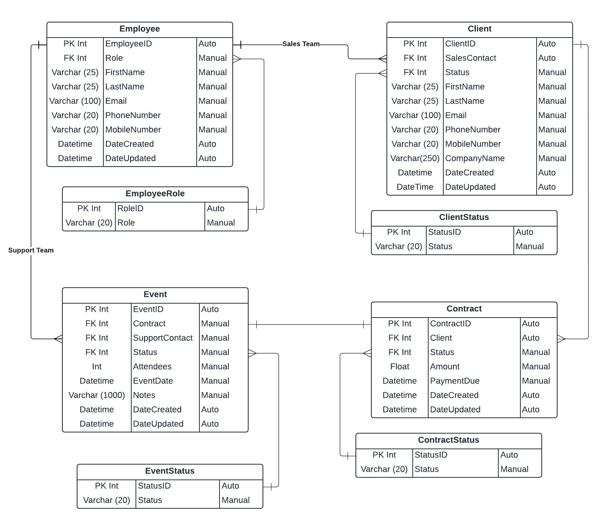

<h1 align="center">
Epic Events CRM<br>
<br/>
</h1>

## Table of Contents
- [Introduction](#introduction)
- [Features](#features)
- [Getting Started](#getting-started)
  - [Prerequisites](#prerequisites)
  - [Installation](#installation)
  - [Tests](#tests)
- [Usage](#usage)
  - [Entity-Relationship Diagram (ERD)](#entity-relationship-diagram)
  - [Django Application](#django-application)
- [API Documentation](#api-documentation)
- [Security Features](#security-features)
  - [Identity and Access Management](#identity-and-access-management)
- [Contributing](#contributing)
- [License](#license)

## Introduction
Welcome to the Epic Events CRM project! Epic Events is a (fictional - for educational purposes) boutique event management and consulting firm specializing in creating epic parties for high-profile clients. 

Security is our top priority, which is why we've developed our own secure cutting-edge internal Customer Relationship Management software (CRM) using Django. This document will guide you through the project's features, installation, usage, and security measures.

## Features
1. Application uses Django Framework (4.2).
2. Integration with PostgreSQL database.
3. Django models representing [important business areas](#entity-relationship-diagram):
   - Epic Events Employees
   - Clients
   - Contracts
   - Events
4. [Admin Login](#admin-site) page for managers.
5. Secure API access for Sales Team Members and Support Team Members, including:
   - [API HTTP requests](#api-http-requests), using tools such as Postman.
   - [Browsable API](#browsable-api).
6. [Filter and search feature](#filter-and-search-features).
7. Employees have compartmentalized [access and permissions](#identity-and-access-management).

## Getting Started

### Prerequisites

Before you begin, ensure you have met the following requirements:
- [Python](https://www.python.org/downloads/) (version 3.10)
- [PostgreSQL](https://www.postgresql.org/download/) database installed and running.

### Installation

1. Clone the repository:
   ```
   git clone https://github.com/franfif/epic-events-crm.git
2. Navigate to the project directory

3. Create a virtual environment (optional but recommended):
    ```
    python -m venv venv
    source venv/bin/activate
4. Install project dependencies:
    ```
    pip install -r requirements.txt
5. Create the database `epiceventsdb` for the project:
    ```
    psql
    CREATE DATABASE epiceventsdb;
   \q
6. Apply database migrations:
    ```
    python manage.py migrate
7. Start the development server:
    ```
    python manage.py runserver
### Tests
All the endpoints have been thoroughly tested.

- To run the tests, use the following command: 
    ```
    python manage.py test
## Usage
### Entity-Relationship Diagram (ERD)
The Entity-Relationship Diagram (ERD) shows the relationships between the various entities of this CRM:<br>
There are 4 main entities within the CRM: employees, clients, contracts, and events. Each of these entities has a linked entity defining their role or status.



- A client is linked to a single employee of the Sales Team. An employee may be linked to multiple clients.
- A contract is linked to a single client. A client may be linked to multiple contracts.
- An event is linked to a single contract. A contract may only be linked to a single event.
- An event is linked to a single employee of the Support Team. An employee may be linked to multiple events.

### Django Application

This CRM is built using Django and offers a user-friendly interface. Here's how you can get started:

#### Admin Site
1. Access the Django admin site:
   - Open your web browser and go to [http://127.0.0.1:8000/admin/](http://127.0.0.1:8000/admin/).
   - Log in with your admin credentials (all managers are admin).
   - For your convenience, an admin is created during the initial migration:
     - Login: epic_manager
     - Password: xAKJ2y+7PWpca#Q3Lr$8bN

2. Use the admin site to manage CRM data, including employees, clients, contracts, and events.

#### API HTTP Requests
To interact with the CRM programmatically, use our secure API endpoints, using tools such as Postman or cURL. Refer to our [online API Documentation](https://documenter.getpostman.com/view/20632376/2s9YJc23n1) for details.

Employees are able to Create, Read, and Update different entities according to their role and the entities they are assigned to. Learn more about authorizations and permissions in the [Identity and Access Management](#identity-and-access-management).

#### Browsable API
Django comes with a very nice browsable API, this interface is also available to employees at this URL: [http://127.0.0.1:8000/api-auth/login/](http://127.0.0.1:8000/api-auth/login/)

#### Filter and Search features
API endpoints allow users to filter and search for items by the following fields:
- Client API endpoints:
  - Client company name
  - Client first name
  - Client last name
  - Client email
- Contract API endpoints:
  - Client's filter and search fields
  - Contract date (search only)
  - Contract amount
- Event API endpoints:
  - Client's filter and search fields
  - Event date (search only)
Learn how to use this feature in the [online API documentation](https://documenter.getpostman.com/view/20632376/2s9YJc23n1).

## API Documentation
The API documentation details how to use the API HTTP requests. <br>
This interface is only accessible to Sales Team Members and Support Team Members. <br>
Managers should use the [Admin Site](#admin-site).

Access the full [online documentation on Postman](https://documenter.getpostman.com/view/20632376/2s9YJc23n1).

The documentation is divided into 4 folders:
1. [Login](https://documenter.getpostman.com/view/20632376/2s9YJc23n1#765f19a3-c574-4ded-a40d-45404fbf8bd4)
2. [Clients](https://documenter.getpostman.com/view/20632376/2s9YJc23n1#4c6618a5-3470-455b-8c1c-fe779efd2ff7)
3. [Contracts](https://documenter.getpostman.com/view/20632376/2s9YJc23n1#09a91c85-b576-407f-9c86-52ab471cf896)
4. [Events](https://documenter.getpostman.com/view/20632376/2s9YJc23n1#9a0338a0-c051-4c46-a46c-cb8fa55157c0)

## Security Features
This application is using the best security features to ensure the safety of data.
- Use of Python 3.
- Prevention against SQL injection:
  - No raw SQL queries are being used in this application.
  - All user inputs are sanitized and converted to safe queries by Django ORM.
- Authentication and authorization are enforced.
  - JWT tokens are used to authenticate users on HTTP requests.
  - Permissions are designed to ensure users have only access to what they need (Principle of Least Privilege).
  - All views have a set of permissions adequate to the user's role and assignment. More information in [Identity and Access Management](#identity-and-access-management).
- Exceptions and error logs are saved in a [specific document](logs/monitoring.log) to monitor any issue that could arise within the application.

### Identity and Access Management
Within Epic Events, Managers, Sales Team Members, and Support Team Members each have distinct roles and responsibilities.<br>
Consequently, their access and permissions within the CRM system are rigorously enforced, encompassing the request methods employed in the API.

The access and permissions are designed as follows:
- Managers
  - Create, View, Update, and Delete any item
  - Assign Sales Employees to Clients
  - Assign Support Employees to Events
- Sales Team Members
  - Create Clients
  - View all Clients
  - Update a Client (if assigned to the Client)
  - Create Contracts
  - View all Contracts
  - Update a Contract (if assigned to its Client)
  - Create an Event for a Contract (if assigned to the Contract's Client)
  - View an Event (if assigned to its Contract's Client)
  - No Delete requests are allowed
- Support Team Members
  - View all Events
  - Update Event (if assigned to it)
  - View a Contract (if assigned to its Event)
  - View a Client (if assigned to the Event of one of its Contracts)
  - No Delete requests are allowed

## Contributing

We welcome contributions to the Epic Events CRM project. To contribute, follow these steps:
1. Fork this repository.
2. Create a new branch for your feature or bug fix.
   - Please include tests for your code.
3. Make your changes and commit them with clear, concise commit messages.
4. Push your changes to your fork.
5. Create a pull request to merge your changes into the main repository.

We appreciate your contributions!

## License
MIT License

Copyright (c) 2023 Francis Barrow

Permission is hereby granted, free of charge, to any person obtaining a copy
of this software and associated documentation files (the "Software"), to deal
in the Software without restriction, including without limitation the rights
to use, copy, modify, merge, publish, distribute, sublicense, and/or sell
copies of the Software, and to permit persons to whom the Software is
furnished to do so, subject to the following conditions:

The above copyright notice and this permission notice shall be included in all
copies or substantial portions of the Software.

THE SOFTWARE IS PROVIDED "AS IS", WITHOUT WARRANTY OF ANY KIND, EXPRESS OR
IMPLIED, INCLUDING BUT NOT LIMITED TO THE WARRANTIES OF MERCHANTABILITY,
FITNESS FOR A PARTICULAR PURPOSE AND NONINFRINGEMENT. IN NO EVENT SHALL THE
AUTHORS OR COPYRIGHT HOLDERS BE LIABLE FOR ANY CLAIM, DAMAGES OR OTHER
LIABILITY, WHETHER IN AN ACTION OF CONTRACT, TORT OR OTHERWISE, ARISING FROM,
OUT OF OR IN CONNECTION WITH THE SOFTWARE OR THE USE OR OTHER DEALINGS IN THE
SOFTWARE.